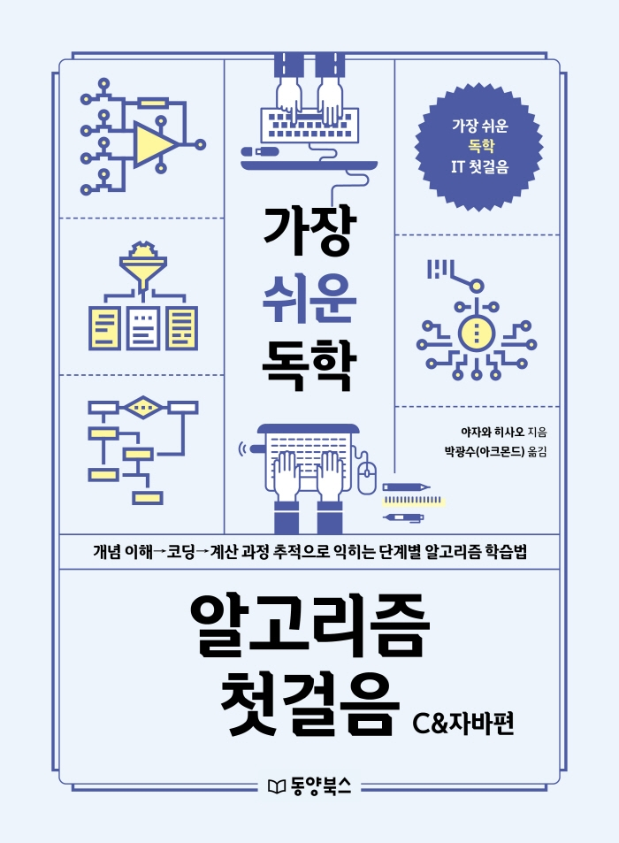

# 공부용 코드 메모
---

내가 공부하면서 사용한 내용들 작성한 곳

자바 문법 및 알고리즘 공부와 관련된 내용임.

※ Chapter 3~10은 아래 책의 문제들

- 3장 이진 탐색과 시간 복잡도
- 4장 다중 반복문과 삽입, 버블, 선택 정렬
- 5장 연결 리스트의 구조와 사용
- 6장 이진 탐색 트리의 추가와 탐색
- 7장 해시 테이블 탐색법
- 8장 재귀 호출과 퀵 정렬
- 9장 동적 계획법과 배낭 문제
  - 9_1 동적 계획법을 이용한 피보나치 수 찾기
  - 9_2 동적 계획법을 이용한 배낭문제 풀이
- 10장 유전 알고리즘과 배낭 문제

※ 책에 나온 코드와 다름.